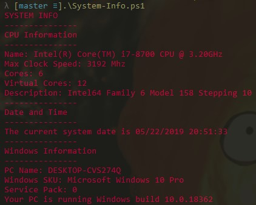
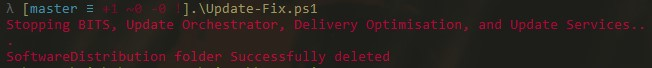
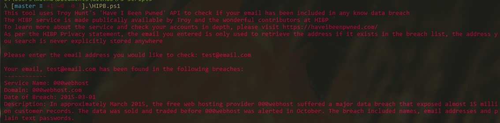

# PS-Scripts
A collection of PowerShell scripts that I'm creating while learning Powershell Syntax

## System Info
Just lists a bunch of system specs, this was just me playing arond with WMIC for the first time. This script literally just displays some basic system info, this was my first exposure to how PowerShell syntax works, and how to interface with Windows via WMIC

## Update-Fix
A script I use to clear out the windows SoftwareDistribution folder. This can help resolve particularly stubborn Windows update issues by
removing the already downloaded update files. Windows 10 now has an Update Troubleshooter built in which makes this largely redundant, however it's nifty to keep around when handling older windows installs.

## HIBP
A script that uses the Have I Been Pwned API made available by Troy Hunt (https://github.com/TroyHunt) to check if the email you've entered has been found in a data breach dump. Right now it just checks for data breaches using the API. The script will display the description of the service and breach as detailed on https://haveibeenpwned.com/.

## Pro2Home
This script changes the necessary registry entries to downgrade a device from Windows 10 Pro to Windows 10 Home, definitely not a common scenario but one I face a lot when imaging devices running pro to devices with home keys (usually surfaces).

This tool requires you to run the Windows 10 upgrade tool via a clean Windows 10 image after use, you can get that here: https://www.microsoft.com/en-au/software-download/windows10
